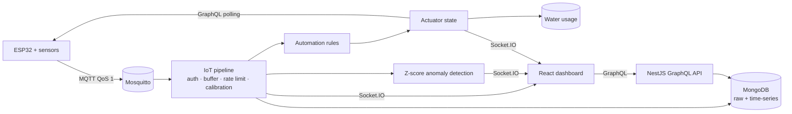

# Smart Farm — Real-time IoT Greenhouse Monitoring & Automated Irrigation

[한국어](./README.md) | **English** | [O'zbekcha](./README.uz.md)

A full-stack IoT platform that ingests ESP32 sensor data over MQTT, cleans, stores and checks it for anomalies, streams the results to a web dashboard in real time, and drives the irrigation pump automatically when the soil dries out.

The goal was to build the entire **closed loop** — sensor → pipeline → rule → actuator → back to the sensor — inside one system.

## Features

- **MQTT ingestion pipeline**: per-device API key authentication, Redis message buffer (ack / DLQ), per-device rate limiting, sensor calibration
- **Dual storage**: raw readings (`sensor_data`) plus a MongoDB time-series collection (`timeSeriesSensorData`, 90-day TTL), with hourly, daily and monthly aggregates
- **Anomaly detection**: rolling per-sensor statistics (mean and standard deviation); readings with Z-score ≥ 2 are recorded and pushed over WebSocket immediately
- **Real-time dashboard**: a JWT-authenticated Socket.IO channel pushes sensor values, alerts, device status and actuator changes
- **IoT pipeline page**: animated data flow, live messages per minute, 24-hour throughput chart, live per-sensor Z-scores, recent anomalies, device health
- **Closed-loop irrigation**: an automation rule such as `SOIL_MOISTURE < 35` turns the pump on, a timer turns it off, and water usage is recorded automatically from run time and flow rate
- **Plant health index**: computed every hour as the share of the last 24 hours that temperature, humidity, soil moisture, pH, CO₂ and EC spent inside their optimal ranges
- **Outdoor weather**: wind speed, wind direction and conditions from Open-Meteo, cached for 10 minutes
- **Multilingual UI**: Korean (default) · English · Uzbek, with dates and relative times localized too
- **Reports**: daily health index per section, soil moisture trends, water usage analytics, alert summaries

## Architecture



## Tech stack

| Area | Technology |
|---|---|
| Backend | NestJS 11, GraphQL (Apollo, code-first), Mongoose 8, Socket.IO, BullMQ, ioredis, MQTT.js |
| Data | MongoDB (time-series collections), Redis |
| Frontend | React 18, Vite, MUI 6, MUI X Charts, Apollo Client, Leaflet |
| IoT | ESP32, Mosquitto MQTT broker |
| Infra | Docker Compose, Caddy |

## Security

- **Resource ownership**: a global GraphQL interceptor finds identifiers in the arguments (`greenHouseId`, `sectionId`, `deviceId`, `sensorId`, …), follows the chain sensor → device → greenhouse → farm → member, and rejects access to another user's resources with 403 (admins excepted).
- **WebSocket authentication**: the JWT is verified on connect, and ownership is checked again when subscribing to a greenhouse channel.
- **Device authentication**: the API key in each MQTT message must belong to that device; failures are recorded in `systemErrorLogs`.
- Operational tooling (message buffer, room statistics) is admin-only.

## Demo mode

In the live demo, data comes from a simulator that goes through **the same MQTT pipeline** as the real ESP32. The `DEMO · simulated sensors` badge in the header says so.

- `backend/scripts/lib/farm-model.js`: a greenhouse model with day/night cycles, changing weather, soil drying, irrigation and tank refills
- `backend/scripts/simulate-device.js`: streams live readings; with `CLOSED_LOOP=true` it reads the pump state from the backend exactly like the real device
- `backend/scripts/backfill-history.js`: generates 30 days of history (tagged `source: 'backfill'` so it never mixes with real data)
- `backend/scripts/setup-closed-loop.js`: creates the pump actuator and the irrigation rule

## Running locally (PowerShell)

```powershell
docker run -d --name mosquitto-dev -p 1883:1883 eclipse-mosquitto:2 mosquitto -c /mosquitto-no-auth.conf

cd backend
npm install
npm run start:dev

cd ..\frontend\smart-farm-frontend
npm install
npm run dev
```

Redis (6379) is required, and the backend `.env` needs the MongoDB connection and `MQTT_BROKER_URL=mqtt://127.0.0.1:1883`.

Running the simulator:

```powershell
cd backend
$env:DEVICE_ID = "<devices._id>"
$env:API_KEY = "<device API key>"
$env:SENSORS = "<sensorId>:TEMPERATURE:°C,<sensorId>:SOIL_MOISTURE:%"
$env:COUNT = "0"
node scripts\simulate-device.js
```

## Feature flags

| Variable | Default | Description |
|---|---|---|
| `VITE_DEMO_MODE` | `true` | Shows the simulated-data badge |
| `VITE_FEATURE_CAMERA` | `false` | Camera live view (enable once camera hardware is connected) |
| `VITE_FEATURE_NDVI` | `false` | NDVI field map (enable once multispectral data is available) |

## Known limitations and roadmap

- The camera and NDVI modules stay behind feature flags until the hardware is connected.
- Some list queries without an identifier (`filterDevices`, `crops`, `fields`) still need per-user filtering.
- There is no model yet for attaching WORKER members to a manager's farm.
- The message buffer retry cron does not actually reprocess messages yet.
