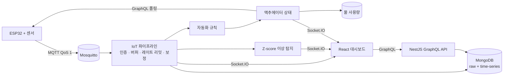

# Smart Farm — 실시간 IoT 온실 모니터링 & 자동 관수

**한국어** | [English](./README.en.md) | [O'zbekcha](./README.uz.md)

ESP32 센서 데이터를 MQTT로 수집해 정제·저장·이상 탐지까지 처리하고, 그 결과를 웹 대시보드에 실시간으로 보여 주며, 토양 수분이 떨어지면 펌프를 자동으로 제어하는 풀스택 IoT 플랫폼입니다.

센서 → 파이프라인 → 규칙 → 액추에이터 → 다시 센서로 이어지는 **폐루프(closed loop)** 전체를 하나의 시스템 안에서 구현하는 것을 목표로 했습니다.

## 핵심 기능

- **MQTT 수집 파이프라인**: 디바이스별 API 키 인증, Redis 메시지 버퍼(ack / DLQ), 디바이스별 레이트 리밋, 센서 보정(calibration)
- **이중 저장**: 원시 데이터(`sensor_data`)와 MongoDB time-series 컬렉션(`timeSeriesSensorData`, 90일 TTL), 시간·일·월 단위 집계
- **이상 탐지**: 센서별 이동 통계(평균·표준편차)를 기반으로 Z-score ≥ 2를 이상치로 기록하고 WebSocket으로 즉시 알림
- **실시간 대시보드**: JWT로 인증된 Socket.IO 채널로 센서 값, 알림, 디바이스 상태, 액추에이터 변화를 푸시
- **IoT 파이프라인 화면**: 데이터 흐름 애니메이션, 분당 처리량, 24시간 처리량 차트, 센서별 실시간 Z-score, 최근 이상치, 디바이스 상태
- **폐루프 자동 관수**: `SOIL_MOISTURE < 35` 같은 자동화 규칙이 펌프를 켜고, 타이머가 끄며, 펌프 가동 시간과 유량으로 물 사용량을 자동 기록
- **식물 건강 지수**: 최근 24시간 동안 온도·습도·토양 수분·pH·CO₂·EC가 최적 범위 안에 있었던 시간 비율로 매시간 자동 계산
- **외부 날씨**: Open-Meteo에서 풍속·풍향·기상 상태를 가져와 10분간 캐시
- **리포트**: 구역별 일일 건강 지수, 토양 수분 추이, 물 사용량 분석, 알림 요약

## 아키텍처



## 기술 스택

| 영역 | 기술 |
|---|---|
| Backend | NestJS 11, GraphQL (Apollo, code-first), Mongoose 8, Socket.IO, BullMQ, ioredis, MQTT.js |
| Data | MongoDB (time-series 컬렉션), Redis |
| Frontend | React 18, Vite, MUI 6, MUI X Charts, Apollo Client, Leaflet |
| IoT | ESP32, Mosquitto MQTT broker |
| Infra | Docker Compose, Caddy |

## 보안

- **리소스 소유권 검증**: 전역 GraphQL 인터셉터가 요청 인자(`greenHouseId`, `sectionId`, `deviceId`, `sensorId` 등)를 찾아 센서 → 디바이스 → 온실 → 농장 → 회원으로 이어지는 소유 관계를 확인하고, 다른 사용자의 리소스 접근은 403으로 차단합니다(ADMIN 예외).
- **WebSocket 인증**: 연결 시 JWT를 검증하고, 온실 채널 구독 시에도 소유권을 확인합니다.
- **디바이스 인증**: MQTT 메시지의 API 키가 해당 디바이스에 발급된 키인지 확인하며, 인증 실패는 `systemErrorLogs`에 기록됩니다.
- 운영 도구(메시지 버퍼, 룸 통계)는 ADMIN 전용입니다.

## 데모 모드

라이브 데모에서는 실제 ESP32와 **동일한 MQTT 파이프라인**을 거치는 시뮬레이터가 데이터를 보냅니다. 화면 상단의 `DEMO · simulated sensors` 배지로 이를 명시합니다.

- `backend/scripts/lib/farm-model.js`: 주야간 주기, 날씨 변화, 토양 건조, 관수, 물탱크 보충을 반영한 온실 모델
- `backend/scripts/simulate-device.js`: 실시간 센서 데이터 전송, `CLOSED_LOOP=true`이면 실제 디바이스처럼 백엔드에서 펌프 상태를 받아 반영
- `backend/scripts/backfill-history.js`: 30일치 이력 데이터 생성(`source: 'backfill'`로 표시되어 실제 데이터와 구분)
- `backend/scripts/setup-closed-loop.js`: 펌프 액추에이터와 자동 관수 규칙 생성

## 로컬 실행 (PowerShell)

```powershell
docker run -d --name mosquitto-dev -p 1883:1883 eclipse-mosquitto:2 mosquitto -c /mosquitto-no-auth.conf

cd backend
npm install
npm run start:dev

cd ..\frontend\smart-farm-frontend
npm install
npm run dev
```

Redis(6379)가 필요하며, 백엔드 `.env`에 MongoDB 접속 정보와 `MQTT_BROKER_URL=mqtt://127.0.0.1:1883`을 설정합니다.

시뮬레이터 실행:

```powershell
cd backend
$env:DEVICE_ID = "<devices._id>"
$env:API_KEY = "<device API key>"
$env:SENSORS = "<sensorId>:TEMPERATURE:°C,<sensorId>:SOIL_MOISTURE:%"
$env:COUNT = "0"
node scripts\simulate-device.js
```

## 기능 플래그

| 변수 | 기본값 | 설명 |
|---|---|---|
| `VITE_DEMO_MODE` | `true` | 시뮬레이션 데이터 배지 표시 |
| `VITE_FEATURE_CAMERA` | `false` | 카메라 라이브뷰 (카메라 하드웨어 연동 후 활성화) |
| `VITE_FEATURE_NDVI` | `false` | NDVI 필드 맵 (멀티스펙트럴 데이터 확보 후 활성화) |

## 알려진 한계 및 개선 예정

- 카메라·NDVI 모듈은 하드웨어 연동 전까지 기능 플래그로 비활성화되어 있습니다.
- ID 없이 전체 목록을 조회하는 일부 쿼리(`filterDevices`, `crops`, `fields`)는 사용자 기준 필터링이 필요합니다.
- WORKER 역할을 매니저의 농장에 연결하는 모델이 아직 없습니다.
- 메시지 버퍼의 재시도 크론은 현재 실제 재처리를 수행하지 않습니다.
