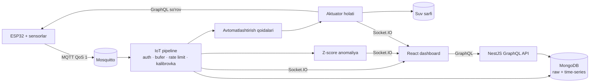

# Smart Farm — real vaqtli IoT issiqxona monitoringi va avtomatik sug'orish

[한국어](./README.md) | [English](./README.en.md) | **O'zbekcha**

ESP32 sensorlaridan MQTT orqali ma'lumot yig'ib, uni tozalaydigan, saqlaydigan va anomaliyalarni aniqlaydigan, natijani veb-dashboard'ga real vaqtda uzatadigan hamda tuproq quriganda nasosni avtomatik boshqaradigan full-stack IoT platforma.

Maqsad — sensor → pipeline → qoida → aktuator → yana sensor zanjirini, ya'ni **yopiq zanjirni (closed loop)** bitta tizim ichida to'liq qurish.

## Asosiy imkoniyatlar

- **MQTT qabul qilish pipeline'i**: har bir qurilma uchun API kalit bilan autentifikatsiya, Redis xabar buferi (ack / DLQ), qurilma bo'yicha rate limit, sensor kalibrovkasi
- **Ikki xil saqlash**: xom o'lchovlar (`sensor_data`) va MongoDB time-series kolleksiyasi (`timeSeriesSensorData`, 90 kunlik TTL), soatlik, kunlik va oylik agregatsiyalar
- **Anomaliyalarni aniqlash**: har bir sensor uchun harakatlanuvchi statistika (o'rtacha va standart og'ish); Z-score ≥ 2 bo'lgan qiymatlar yoziladi va WebSocket orqali darhol xabar qilinadi
- **Real vaqtli dashboard**: JWT bilan himoyalangan Socket.IO kanali orqali sensor qiymatlari, alert'lar, qurilma holati va aktuator o'zgarishlari uzatiladi
- **IoT Pipeline sahifasi**: ma'lumot oqimi animatsiyasi, minutiga o'lchovlar soni, 24 soatlik throughput grafigi, har bir sensorning jonli Z-score'i, oxirgi anomaliyalar, qurilmalar holati
- **Yopiq zanjirli sug'orish**: `SOIL_MOISTURE < 35` kabi avtomatlashtirish qoidasi nasosni yoqadi, taymer uni o'chiradi, suv sarfi esa ishlagan vaqt va oqim tezligidan avtomatik hisoblanib yoziladi
- **O'simlik salomatligi indeksi**: har soatda avtomatik hisoblanadi — so'nggi 24 soat davomida harorat, namlik, tuproq namligi, pH, CO₂ va EC optimal diapazonda bo'lgan vaqt ulushi
- **Tashqi ob-havo**: shamol tezligi, yo'nalishi va ob-havo holati Open-Meteo'dan olinadi va 10 daqiqa keshlanadi
- **Ko'p tilli interfeys**: koreyscha (standart) · inglizcha · o'zbekcha, sanalar va nisbiy vaqtlar ham tanlangan tilda
- **Hisobotlar**: section'lar bo'yicha kunlik salomatlik indeksi, tuproq namligi trendi, suv sarfi tahlili, alert'lar xulosasi

## Arxitektura



## Texnologiyalar

| Soha | Texnologiya |
|---|---|
| Backend | NestJS 11, GraphQL (Apollo, code-first), Mongoose 8, Socket.IO, BullMQ, ioredis, MQTT.js |
| Ma'lumotlar | MongoDB (time-series kolleksiyalar), Redis |
| Frontend | React 18, Vite, MUI 6, MUI X Charts, Apollo Client, Leaflet |
| IoT | ESP32, Mosquitto MQTT broker |
| Infratuzilma | Docker Compose, Caddy |

## Xavfsizlik

- **Resurs egaligini tekshirish**: global GraphQL interceptor so'rov argumentlaridan (`greenHouseId`, `sectionId`, `deviceId`, `sensorId` va boshqalar) ID'larni topadi, sensor → qurilma → issiqxona → ferma → foydalanuvchi zanjiri bo'ylab egalikni tekshiradi va boshqa foydalanuvchining resursiga murojaatni 403 bilan rad etadi (ADMIN bundan mustasno).
- **WebSocket autentifikatsiyasi**: ulanishda JWT tekshiriladi, issiqxona kanaliga obuna bo'lishda egalik qayta tekshiriladi.
- **Qurilma autentifikatsiyasi**: har bir MQTT xabaridagi API kalit aynan shu qurilmaga tegishli bo'lishi shart; xatolar `systemErrorLogs`'ga yoziladi.
- Operatsion vositalar (xabar buferi, room statistikasi) faqat ADMIN uchun ochiq.

## Demo rejim

Jonli demoda ma'lumotlar haqiqiy ESP32 bilan **bir xil MQTT pipeline'dan** o'tadigan simulyatordan keladi. Header'dagi `DEMO · simulated sensors` belgisi buni ochiq ko'rsatadi.

- `backend/scripts/lib/farm-model.js`: kecha-kunduz sikli, o'zgaruvchan ob-havo, tuproqning qurishi, sug'orish va bakning to'ldirilishini hisobga oladigan issiqxona modeli
- `backend/scripts/simulate-device.js`: jonli o'lchovlarni yuboradi; `CLOSED_LOOP=true` bo'lganda haqiqiy qurilma kabi nasos holatini backend'dan oladi
- `backend/scripts/backfill-history.js`: 30 kunlik tarix yaratadi (`source: 'backfill'` bilan belgilanadi, haqiqiy ma'lumotlar bilan aralashmaydi)
- `backend/scripts/setup-closed-loop.js`: nasos aktuatori va sug'orish qoidasini yaratadi

## Lokal ishga tushirish (PowerShell)

```powershell
docker run -d --name mosquitto-dev -p 1883:1883 eclipse-mosquitto:2 mosquitto -c /mosquitto-no-auth.conf

cd backend
npm install
npm run start:dev

cd ..\frontend\smart-farm-frontend
npm install
npm run dev
```

Redis (6379) kerak bo'ladi, backend `.env` faylida esa MongoDB ulanishi va `MQTT_BROKER_URL=mqtt://127.0.0.1:1883` ko'rsatiladi.

Simulyatorni ishga tushirish:

```powershell
cd backend
$env:DEVICE_ID = "<devices._id>"
$env:API_KEY = "<qurilma API kaliti>"
$env:SENSORS = "<sensorId>:TEMPERATURE:°C,<sensorId>:SOIL_MOISTURE:%"
$env:COUNT = "0"
node scripts\simulate-device.js
```

## Feature flag'lar

| O'zgaruvchi | Standart | Tavsif |
|---|---|---|
| `VITE_DEMO_MODE` | `true` | Simulyatsiya ma'lumotlari belgisini ko'rsatadi |
| `VITE_FEATURE_CAMERA` | `false` | Kamera jonli ko'rinishi (kamera apparati ulangandan keyin yoqiladi) |
| `VITE_FEATURE_NDVI` | `false` | NDVI xaritasi (multispektral ma'lumot paydo bo'lgandan keyin yoqiladi) |

## Ma'lum cheklovlar va reja

- Kamera va NDVI modullari apparat ulanmaguncha feature flag orqali o'chirilgan.
- ID'siz ro'yxat qaytaradigan ba'zi so'rovlar (`filterDevices`, `crops`, `fields`) hali foydalanuvchi bo'yicha filtrlanmaydi.
- WORKER rolini menejerning fermasiga bog'laydigan model hali yo'q.
- Xabar buferining retry cron'i hozircha xabarlarni haqiqatan qayta ishlamaydi.
